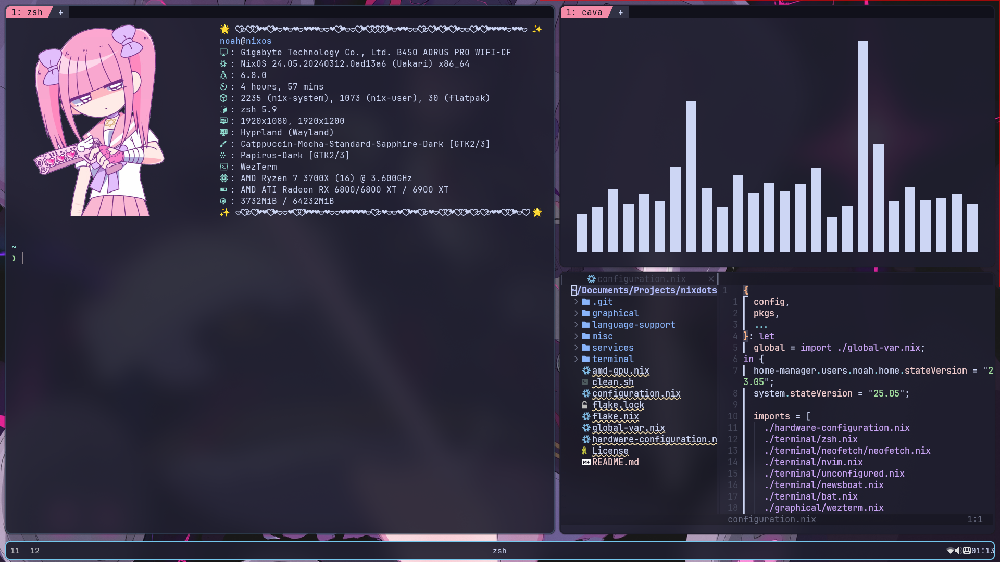

This repository contains my NixOS system configurations. It is not meant to be for everyone or really anyone but myself. I would not recommend running it. Instead, feel free to take things that you like from it. However, you are free to run it anyway; just don't expect support outside of bug fixes. If something doesn't work the way you want it, that is your problem unless I agree that it is a problem. That being said, I do welcome suggestions. If you find a program or config that I might like, please tell me about it in issues. Note that I may not use it as it is made for my preferences, not yours.

## Installation:
Please note that unless you have an AMD GPU, a 165Hz monitor, the same username, and the same disk name as I do, you might need to do some hacking. As of now, I have not rewritten the installation instructions to take Flakes into account.

## TODO:
- Rewrite instructions
- Finalize NeoVim configs
- Look into VimWiki
- Write configs for laptop "server" for some kind of file server and sync
- Declare Firefox/Floorp configurations
- Add hosts file back, maybe with a Systemd job to update them
- Look into disabling the 2nd display when in TTY
- Later look into replacing login manager with Cosmic one if it becomes viable
- Consider switching to Cosmic completely when it's fully out and has good Nix support
- Install and set up Open Tablet Driver
- Write config for server and phone via Termux fork and Flakes
- Organize code
- Generally clean code
